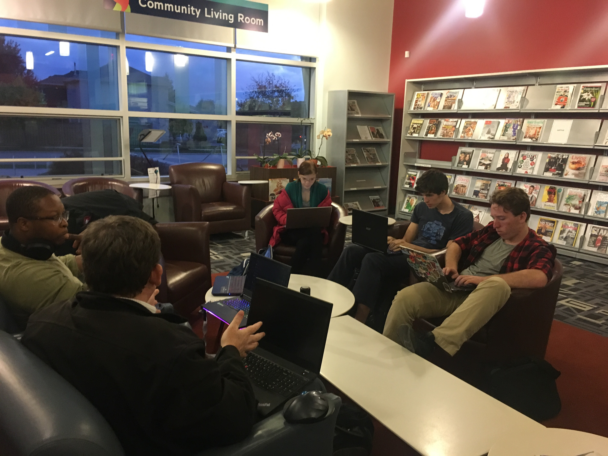
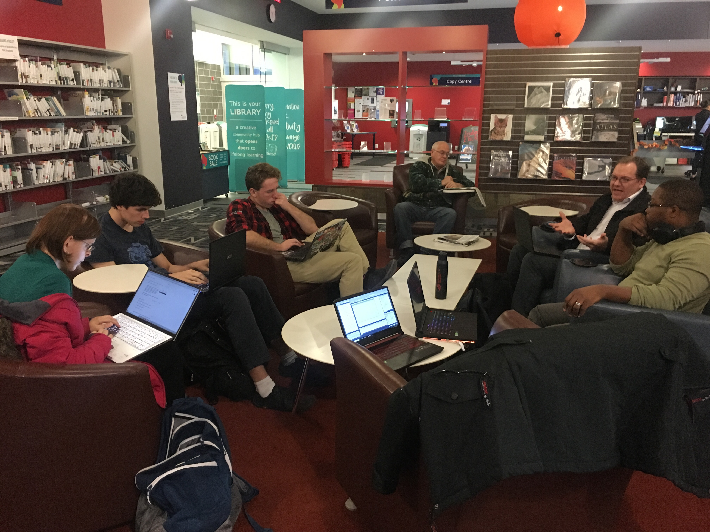

*(sadly I'm just now catching up, apologies - @paulywill, JAN 07/2021)*

# v4.2019 - October 25, 2019 
**Location:** Study Room @ [Painswick Library](https://goo.gl/maps/m8Md2gRV5rzx6hVi9)

**Time:** 5pm - ?

**Organizer/Secretary:** [@paulywill](https://github.com/paulywill)
**Chair/Host:** Emilie Ah-Fock 

## Meeting 

Thank you Emilie for agreeing to chair the meeting! :)

We were fortunate to have her carry torch for this meeting. You can find her on [Instagram](https://www.instagram.com/emilie.ahfock/), [LinkedIn](www.linkedin.com/in/emilie-ah-fock-679974157), and [YouTube](https://www.youtube.com/channel/UCSP6LtNYc58tPM5KRkp8DZw).

While there were not minutes captured what was discussed, covered, or shared... here's are some awesome images and video of the event that Emilie was able to capture.

